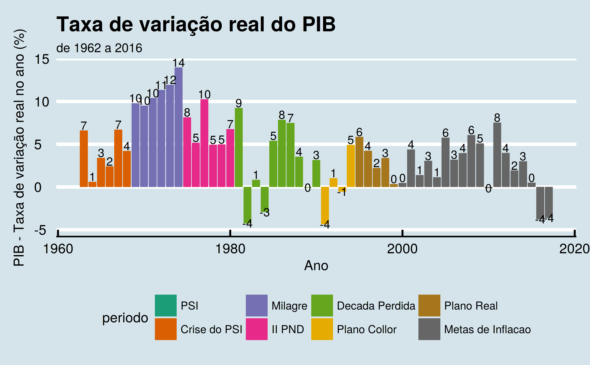
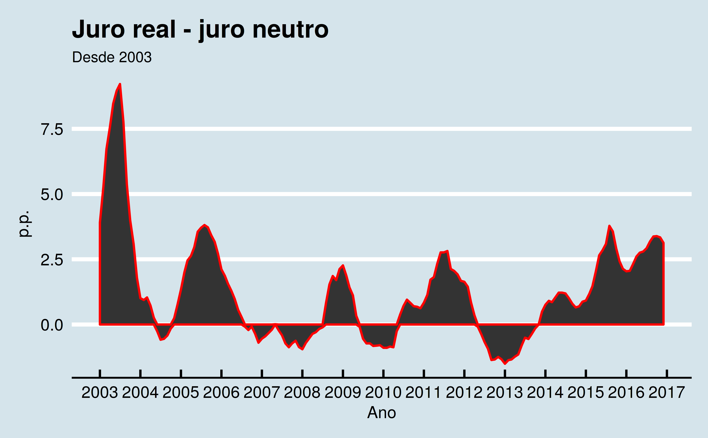

## Conceitos das principais variáveis econômicas {#sec:conceitos}

Esta seção trata dos principais conceitos econômicos a serem utilizados para a discussão de nossa tese.

### Econometria

Uma definição abrangente e concisa para a econometria pode ser vista em \cite[p.~36]{rossetti}: "a **econometria** é um ramo da economia que combina a análise econômica, a matemática e a estatística. Trabalha com a determinação, por métodos matemáticos e estatísticos, de leis quantitativas que regem a vida econômica."

Já para \citeauthoronline{blanchard}, **Econometria** é "o conjunto de técnicas estatísticas concebidas para usar em economia" \cite[p.~567]{blanchard}[...] para, "estimar as relações comportamentais e encontrar os valores dos parâmetros relevantes."

Ainda segundo \citeauthoronline{blanchard}, "**a econometria** pode se tornar bastante técnica, mas os princípios básicos por trás dela são simples."

Os principais campos de investigação da econometria podem ser elencados como abaixo \cite[p.~36]{rossetti}:

- a análise do equilíbrio geral da economia como um todo;
- A análise matricial dos fluxos de bens e serviços entre os diferentes setores da economia nacional;
- A teoria dos jogos, como instrumento importante para simular questões estratégicas.

### Macroeconomia

A definição de Produto Interno Bruto (PIB) pode ser feita de várias maneiras, como podemos ver na \autoref{subsubsec:pib}. Uma das possíveis de definições de PIB, mais útil para o estudo da Macroeconomia  e da Macroeconometria, isto é, do estudo econométrico da Macroeconomia, é:

> o somatório anual de todas as riquezas produzidas pelo País. Ele pode ser medido de várias formas diferentes. Uma delas é pela renda gerada pelos diferentes setores da economia sendo, neste caso, representado pela \autoref{eq:macro} \cite[p.~53]{fortuna2015}:

\begin{equation} \label{eq:macro}
C(\stackrel{+}{y}) + I(\bar{r}) + G + ([X - M]\stackrel{+}{(r^*)}) = Y
\end{equation}

Onde:

- $C(\stackrel{+}{y})$ é o consumo das famílias e que é uma função
  direta da renda $y$ por elas recebida;
- $I(\bar{r})$ é o investimento das empresas e que é uma função indireta da taxa de juros $r$;
- $G$ é o gasto líquido do governo em todos os seus níveis;
- $[X - M]\stackrel{+}{(r^*)}$ é o saldo entre as exportações $X$ e as
  importações $M$, que é uma função direta da taxa de câmbio $r^*$ de reais por dólar;
- $Y$ é a renda agregada como medida do PIB.

A Política de Rendas define o $C(\stackrel{+}{y})$, a Política Monetária define o $I(\bar{r})$, a Política Fiscal o $G$, e a Política Cambial o $[X - M]\stackrel{+}{(r^*)}$ \cite[p.~53]{fortuna2015}.

Para \citeauthoronline{fortuna2015}, cada política:

> tem sua dinâmica própria no rumo de seus objetivos específicos e no contexto de política econômica nacional, que, desde o final da década de 1990, têm como pilares a meta de inflação na política
 monetária, a taxa de câmbio flutuante na política cambial e o superávit primário acima de 3% na política fiscal \cite[p.~53]{fortuna2015}.

### Medidas de nível do produto

#### PIB real e PIB nominal {#subsubsec:pib}

De \citeauthoronline{blanchard} podemos extrair algumas das possíveis definições para o **PIB**, ou seja, o Produto Interno Bruto de uma economia, úteis para o presente trabalho:

- **PIB** é a medida do *produto agregado* nas contas nacionais \cite[p.~20]{blanchard};
- **PIB** é o valor dos bens e serviços finais produzidos em uma
  economia em um dado período \cite[p.~21]{blanchard};
- **PIB** é a soma das rendas na economia em um dado período \cite[p.~21]{blanchard}.

Existem diversas maneiras para medir o PIB. 

"O *PIB nominal* é a soma de quantidades de bens finais multiplicadas por seus preços correntes" \cite[p.~22]{blanchard}.

"O *PIB real* é calculado como a soma das quantidades de bens finais multiplicadas por preços *constantes*" \cite[p.~22]{blanchard}.

#### Deflator do PIB {#subsubsec:deflator}

Segundo \cite[p.~29]{blanchard}, o deflator do PIB no ano $t$, $P_t$, é definido como a razão entre o PIB nominal e o PIB real no ano $t$, ou seja:

$$P_t = \frac{PIB\: nominal_t}{PIB\: real_t} = \frac{\$Y_t}{Y_t}$$

#### PIB e PNB

"Há uma diferença sutil entre 'interno' e 'nacional' e, portanto, entre PIB e PNB" \cite[p.~20]{blanchard}. Enquanto o Produto Interno Bruto (PIB) "corresponde ao valor adicionado domesticamente", o PNB "corresponde ao valor adicionado por fatores de produção de posse
doméstica" \cite[p.~363]{blanchard}.

Segundo \cite{blanchard}, "para a maioria dos países, a diferença entre o PNB e o PIB é normalmente pequena." "O PNB é igual ao PIB mais os pagamentos líquidos de fatores do resto do mundo" \cite[p.~363]{blanchard}.

### Inflação, taxa de inflação e índices de preços

Na trecho abaixo, extraído de \citeonline[p.~28]{blanchard}, podemos ver definições concisas de *inflação* e *taxa de inflação*:

> A *inflação* é elevação sustentada do nível geral de preços da economia - conhecido como *nível de preços*. A *taxa de inflação* é a taxa à qual o nível de preços aumenta. (Simetricamente, *deflação* é uma queda sustentada do nível de preços. Corresponde a uma taxa de inflação negativa).

Ainda segundo \citeauthoronline{blanchard}, "os macroeconomistas geralmente examinam duas medidas do nível de preços, ou seja, dois *índices de preços*: o deflator do PIB e o índice de preços ao consumidor", que são definidos na \autoref{subsubsec:deflator} e na \autoref{subsubsec:IPCA}.

#### IPCA {#subsubsec:IPCA}

O IPCA é o principal índice de preços ao consumidor, o mais utilizado no Brasil, pesquisado pelo IBGE. Segundo informa o próprio IBGE, a população-objetivo do IPCA "abrange as famílias com rendimentos mensais
compreendidos entre 1 (hum) e 40 (quarenta) salários-mínimos, qualquer que seja a fonte de rendimentos, e residentes nas áreas urbanas das regiões"[^ipca]

As regiões pesquisadas pelo IBGE são as regiões metropolitanas de: "Belém, Fortaleza, Recife, Salvador, Belo Horizonte, Rio de Janeiro, São Paulo, Curitiba, Vitória e Porto Alegre, Brasília e municípios de
Goiânia e Campo Grande"[^ipca].

[^ipca]: [www.ibge.gov.br/home/estatistica/indicadores/precos/inpc_ipca/defaultinpc.shtm](http://www.ibge.gov.br/home/estatistica/indicadores/precos/inpc_ipca/defaultinpc.shtm).

### Emprego, desemprego e taxa de desemprego

Para \citeauthoronline{blanchard}, **Emprego** (como variável macroeconômica) "é o número de pessoas que têm trabalho", enquanto **Desemprego** "é o número de pessoas que não têm trabalho, mas estão à procura de um." E, finalmente, **Força de trabalho** "é a soma de emprego e desemprego."

A **taxa de desemprego** é a razão entre o número de pessoas desempregadas e o número de pessoas na força de trabalho.

#### Taxa de desemprego natural

Segundo \citeonline[p.~156]{blanchard}, a taxa natural de desemprego é:

> a taxa de desemprego necessária para manter a inflação constante . É por isso que a taxa natural é também chamada **taxa de desemprego não aceleradora da inflação**, ou **TDNAI** (da expressão em inglês  *Nonacellerating Inflation Rate of Unemployment*, ou **NAIRU**)

#### Nível Natural do Emprego

Segundo \citeonline[p.~119]{blanchard}, "relacionado com a taxa natural de desemprego, está o **nível natural de emprego**, o nível de emprego que prevalece quando o desemprego é igual à sua taxa natural."

#### Nível Natural do Produto

De acordo com \citeonline[p.~119]{blanchard}, "relacionado ao nível natural de emprego está o **nível natural do produto**, o nível de produção quando o emprego é igual ao nível natural do emprego"

### Taxas de juros

#### Taxa nominal de juros vs. taxa real de juros

Segundo \citeauthoronline{blanchard}, taxa nominal de juros é aquela que é "expressa em termos de moeda nacional" \cite[p.~274]{blanchard}, enquanto que a taxa real de juros é aquela que é "expressa em termos de uma cesta de bens" \cite[p.~274]{blanchard}.

De acordo com \citeauthoronline{blanchard}, "se representarmos a taxa real de juros do ano $t$ por $r_t$, então, por definição, tomar emprestado o equivalente a uma cesta de bens este ano corresponderá a que você pague o equivalente a $1 + r_t$ cestas de bens no próximo ano."

#### Relação entre taxa nominal e taxa real de juros

Segundo \citeauthoronline{blanchard}, a taxa de juros real do ano $t$, $r_t$ pode ser expressa em função da taxa de juros nominal do ano $t$, $i_t$ e da inflação esperada $\pi_{t+1}^e$ para o próximo período, $t+1$, através da fórmula abaixo \cite[p.~276]{blanchard}:

$$r_t\approx i_t - \pi_{t+1}^e$$

#### Taxa de juros reais *ex-ante* e taxa de juros reais *ex-post*

Segundo o Banco Central do Brasil, "o comportamento da taxa real de juros pode ser analisado sob duas óticas":

A taxa real de juros *ex-ante*, é aquela que "compara a taxa de juros contratada para determinado período com a taxa esperada de inflação ao longo do mesmo período. Essa é a taxa mais relevante, pois é a utilizada pelos agentes econômicos para a tomada de decisões." \cite[p.~52]{ri}

Já a taxa real de juros *ex-post*, e aquele que "compara a taxa de juros acumulada durante um período no passado com a inflação efetiva durante o mesmo período. Essa taxa reflete o que aconteceu no passado e não as expectativas correntes" \cite[p.~52-53]{ri}.

#### Taxa básica de juros ou taxa Selic

A definição do Banco Central do Brasil para a nossa taxa básica de juros (nominal), a taxa Selic, pode ser vista abaixo:

> Define-se Taxa Selic como a taxa média ajustada dos financiamentos diários apurados no Sistema Especial de Liquidação e de Custódia (Selic) para títulos federais. Para fins de cálculo da taxa, são considerados os financiamentos diários relativos às operações registradas e liquidadas no próprio Selic e em sistemas operados por câmaras ou prestadores de serviços de compensação e de liquidação (art. 1° da Circular n° 2.900, de 24 de junho de 1999, com a alteração introduzida pelo art. 1° da Circular n° 3.119, de 18 de abril de 2002)[^selic]

[^selic]: [www.bcb.gov.br/htms/selic/conceito_taxaselic.asp](http://www.bcb.gov.br/htms/selic/conceito_taxaselic.asp)

### Taxas de câmbio

#### Taxa de câmbio nominal

As taxas nominais de câmbio entre duas moedas podem ser expressas de duas maneiras \cite[p.~354]{blanchard}:

- Como o preço da moeda nacional em termos de moeda estrangeira
- Como o preço da moeda estrangeira em termos de moeda nacional

#### Taxa de câmbio real

Segundo \cite[p.~356]{blanchard}, a taxa real de câmbio expressa "o preço dos bens domésticos em termos de bens estrangeiros."

Sendo $E$ a taxa nominal de câmbio, $P$ o nível de preços num país A e $P^*$ o nível de preços num país B, a taxa real de câmbio $e$, entre os países A e B pode ser expressa através da seguinte fórmula \cite[p.~356]{blanchard}:

$$e = \frac{EP}{P^*}$$

#### Taxa de câmbio multilateral (taxa real de câmbio multilateral)

É a "taxa real de câmbio entre um país e seus parceiros comerciais, calculada como a média ponderada das taxas reais de câmbio bilaterais. Também chamada de taxa real de câmbio ponderada ou taxa real de câmbio efetiva" \cite[p.~583]{blanchard}.

### Dívida Pública Federal

#### Dívida Bruta

A dívida bruta é "a soma dos itens que compõem o passivo financeiro do governo federal" \cite[p.~537]{blanchard}.

#### Dívida Líquida

"Mais relevante, é a dívida líquida, ou, de modo equivalente, a *dívida em poder do público* \cite[p.~537]{blanchard}. Ou seja, em outras palavras, a dívida pública mede a diferença entre o passivo total e os ativos financeiros do governo[^divida]

[^divida]: [epocanegocios.globo.com/Economia/noticia/2016/09/entenda-diferenca-entre-divida-publica-bruta-e-divida-liquida.html](http://epocanegocios.globo.com/Economia/noticia/2016/09/entenda-diferenca-entre-divida-publica-bruta-e-divida-liquida.html).

#### Razão dívida-PIB

#### Restrição orçamentária do governo

Segundo \citeauthoronline{blanchard}, "a restrição orçamentária do governo relaciona a variação da dívida pública com o nível inicial da dívida (que afeta o pagamento de juros), os gastos do governo atuais e os impostos atuais" \cite[p.525]{blanchard}

De acordo com \citeauthoronline{blanchard}, "frequentemente, convém decompor o déficit na soma de dois termos":

- Pagamento de juros sobre a dívida, $rB_{t-1}$.
- A diferença entre os gastos e os impostos, $G_t - T_t$, é chamado de **déficit primário** (ou, de maneira equivalente, $T_t - G_t$ é chamado **superávit primário**)

## Breve Histórico

Nesta seção pretendemos demonstrar a evolução das principais variáveis macroeconômicas no Brasil, definidas na \autoref{sec:conceitos} desde a implantação do Real, em julho de 1994.

### Principais variáveis macroeconômicas desde o Plano Real

A variação do IPCA mensal, desde julho de 1994, pode ser vista na \autoref{IPCA}.

{#IPCA largura=80%}

Fonte: SGS/BCB - Série 433

A \autoref{IPCA_anual} mostra os dados do IPCA anualizados, em forma de barras.

{#IPCA_anual largura=80%}

Fonte: SGS/BCB - Série 433

A \autoref{cambio_nominal} mostra o gráfico da variação da cotação do dólar em relação ao real, desde julho de 1994. Já a \autoref{cambio_real} mostra a variação da taxa de câmbio real efetiva no mesmo período.

{#cambio_nominal largura=80%}

Fonte: SGS/BCB - Série 10813

{#cambio_real largura=80%}

Fonte: SGS/BCB - Série 11752

A \autoref{PIB} mostra a evolução do PIB real, em Reais do último ano, enquanto a \autoref{PIB_anual} mostra a evolução da taxa de crescimento anual do PIB real.

{#PIB largura=80%}

Fonte: SGS/BCB - Série 1208

{#PIB_anual largura=80%}

Fonte: SGS/BCB - Série 7326

A \autoref{selic} mostra a variação da taxa Selic desde julho/1994, acumulada em 12 meses.

{#selic width=80%}

Fonte: SGS/BCB - Série 4189

A \autoref{juro_real} mostra a evolução da taxa de juros reais mensal (*ex-post*) do Brasil, desde julho de 1994.

{#juro_real largura=80%}

Fonte: SGS/BC - Séries 4390 e 433

A \autoref{juro_real_anual} mostra a evolução da taxa de juros reais anualizada (*ex-post*), desde junho de 1995, primeiro período onde o efeito da hiperinflação prevalecente antes do plano real já havia se dissipado.

{#juro_real_anual largura=80%}

Fonte: SGS/BC - Séries 4189 e 13522

Por fim, a \autoref{dif_juros} mostra o diferencial de juros, ou seja, a diferença entre a taxa de juros reais *ex-ante* e a taxa de juros neutra.

{#dif_juros largura=80%}

Fonte: Autor

## O debate dos juros

Recentemente teve início um intenso debate[^debate] sobre a eficácia do regime de metas de inflação no Brasil, sistema que é a base da política monetária dos principais bancos centrais do mundo desde meados dos anos 1990.

[^debate]: [www.valor.com.br/debatedosjuros](http://www.valor.com.br/debatedosjuros)

## André Lara Resende: primeiro artigo

O debate teve início em janeiro de 2017 com artigo **Juros e Conservadorismo Intelectual** \cite{resende1}[^resende1]

[^resende1]: [www.valor.com.br/cultura/4834784/juros-e-conservadorismo-intelectual](http://www.valor.com.br/cultura/4834784/juros-e-conservadorismo-intelectual)

De acordo com \citeauthoronline{resende1}, "desde a estabilização da inflação crônica, com o Real --- e já se vão mais de 20 anos ---, a taxa básica de juros no Brasil causa perplexidade entre os analistas. Por que tão alta?"

Ainda de acordo com \citeauthoronline{resende1}, embora diversas explicações tenham sido elaboradas, "nenhuma delas foi capaz de dar uma resposta convincente e definitiva para a questão."

A taxa básica de juros é o principal instrumento da política monetária. "Juros mais altos reduzem a demanda agregada, desaquecem a economia e moderam a inflação; juros mais baixos elevam a demanda agregada, aquecem a economia e pressionam a inflação. Esta é a
essência do mecanismo de funcionamento da política monetária." Já "quanto à inflação, sempre houve controvérsia."

> O debate entre monetaristas e keynesianos, da segunda metade do século XX, deu lugar a um consenso pós-keynesiano. Com o reconhecimento de que instrumento usado pelos bancos centrais não são os agregados monetários, mas sim a taxa de juros, e a adoção das metas para a inflação, chegou-se ao atual relativo consenso sobre a condução da política monetária.

De acordo com \citeauthoronline{resende1}, "os modelos monetaristas, cujo cerne era a TQM, expressa na equação MV = PY, provavelmente a relação mais conhecida de toda a teoria econômica, pressupõem que a velocidade de circulação da moeda, V, seja estável."

No entanto, a partir da grande crise financeira de 2008, segundo \citeauthoronline{resende1}, este consenso estaria definitivamente ultrapassado: "A experiência revolucionária dos bancos centrais do mundo desenvolvido, desde a grande crise financeira de 2008, não deixa mais dúvida: todos os modelos macroeconômicos que adotam alguma versão da Teoria Quantitativa da Moeda (TQM) estão equivocados e devem ser definitivamente aposentados", haja vista que, depois de 2008  os "bancos centrais aumentaram a oferta de moeda numa escala nunca vista." 

"Logo, com o nível de atividade econômica, Y, mais ou menos constante, um brutal aumento da quantidade de moeda, M, levaria a um aumento proporcional do nível de preços, P, portanto, a uma explosão inflacionária. Não foi o que ocorreu."

Segundo \citeauthoronline{resende1}, os modelos neokeynesianos, "até hoje usados pelos bancos centrais", tampouco explicam o comportamento estável da inflação com taxas de juros tão baixas nos países desenvolvidos: 

> Segundo a chamada Regra de Taylor, para estabilizar a inflação, o juro deve ser reduzido ou aumentado mais do que proporcionalmente e de maneira inversa ao movimento observado na inflação. Se a política monetária for passiva, ou seja, não reagir de maneira inversa e mais do que proporcional aos movimentos observados na taxa de inflação, a inflação ficará instável. Assim que a taxa de juros atingisse, como de fato atingiu, um limite inferior nominal, próximo de zero, o processo deflacionário se tornaria incontrolável. Também não foi o que ocorreu.

\citeauthoronline{resende1} finalmente afirma que "o único modelo compatível com a estabilidade observada da inflação é o neokeynesiano mais recente, na sua vertente neo-fisheriana, utilizado apenas na fronteira acadêmica, pois além de sérias complicações analíticas, inverte a relação entre juros e inflação. A condução da política monetária estaria assim, há décadas, seriamente equivocada."

## Marcos Lisboa e Samule Pessoa: a réplica

\citeauthoronline{lisboapessoa} foram os primeiros a rebater Resende, em 20/01/2017, também no Jornal Valor Econômico, com o artigo **Nada de novo no debate monetário no Brasil** \cite{lisboapessoa} [^lisboapessoa].

[^lisboapessoa]: [www.valor.com.br/cultura/4842254/nada-de-novo-no-debate-monetario-no-brasil](http://www.valor.com.br/cultura/4842254/nada-de-novo-no-debate-monetario-no-brasil)

Segundo \citeauthoronline{lisboapessoa}, apesar da proposição de Cochrane, "que aumentos da taxa nominal de juros podem ajudar à recuperação da economia americana", ou seja, o contrário do que preconiza a teoria monetária padrão, "seria desejável uma robusta
evidência empírica para extrair dessa possibilidade uma proposta de condução alternativa de política monetária no Brasil", haja vista que "do formulador da política pública, espera-se a análise da melhor evidência disponível para adotar medidas que podem afetar a muitos. A
política monetária requer o cuidado do enfermeiro", e citam evidências históricas da eficácia da política monetária tradicional no combate a inflação: 

> Em agosto de 1979, Paul Volcker assumiu a presidência do banco central americano (Fed). A inflação estava em cerca de 9% ao ano, e se esperava que pudesse aumentar ainda mais. Volcker iniciou um longo período de combate à inflação e a taxa básica de juros chegou a ultrapassar 18% ao ano. A política monetária vinha de pouco mais de uma década de leniência com a inflação, acomodando choques de oferta, como o do petróleo. Essa longa leniência contaminou as expectativas e tornou o combate à inflação muito mais custoso. Havia dúvidas sobre o comprometimento do Fed com a estabilização da economia e foram necessários quase quatro anos para que a inflação cedesse. 

\citeauthoronline{lisboapessoa} argumentam que até "pode-se criticar a qualidade da execução da estratégia do modelo padrão em vários momentos. Mas não parece haver evidência de que cortes abruptos de juros reduzam a inflação por aqui."

Pelo contrário, segundo os mesmos a "condução da política monetária em 2011 ilustra as consequências da intervenção motivada por um diagnóstico equivocado", se referindo ao período no qual o Bacen reduziu a taxa de juros básica aos níveis historicamente mais baixos
desde a estabilização.

\citeauthoronline{lisboapessoa} veem a condução heterodoxa da política monetárias dos países desenvolvidos a partir de 2008 motivada pela impossibilidade de utilização do modelo padrão da política monetária "quando a taxa neutra de juros se aproxima de zero", explicitam os
mecanismos que fariam, segundo a teoria de Cochrane, o aumento dos juros ocasionar o aumento da inflação, e concluem que "nada indica que a conjectura seja válida para a economia brasileira." Pelo contrário, argumentam que "os testes empíricos disponíveis indicam que o modelo padrão funciona por aqui: aumento da taxa real de juros reduz a demanda, como ilustra a atual queda da inflação em contraposição ao afrouxamento da política monetária a partir de agosto de 2011."

## André Lara Resende: a tréplica

\citeauthoronline{resende2}, em 27/01/2017, volta ao debate com o artigo **Teoria, prática e bom senso** \cite{resende2}[^resende2] e afirma que "no Brasil, a inflação é muito pouco sensível à taxa de juros. As razões da ineficácia da política monetária são muitas e controvertidas, mas a baixa sensibilidade da inflação à taxa de juros é indiscutível, uma unanimidade" e que "o custo fiscal da política monetária não é irrelevante."

[^resende2]: [www.valor.com.br/cultura/4849060/teoria-pratica-e-bom-senso](http://www.valor.com.br/cultura/4849060/teoria-pratica-e-bom-senso)

Segundo \citeauthoronline{resende2}, ainda, "da política monetária só se pode pedir que evite maiores flutuações do nível de atividade e balize as expectativas de inflação. Sem credibilidade fiscal a política monetária é impotente."

## José Júlio Senna: xxxxxxx

\citeauthoronline{senna}[^senna], em artigo de 10/02/2017, **Taxa de Juros e Inflação** \cite{senna}, refuta a linha de argumentação de Cochrane, haja vista que "as abordagens teóricas criticadas há décadas funcionam bem para explicar fenômenos monetários, como também é possível reconciliá-las com os resultados observados após a crise financeira."

[^senna]: [www.valor.com.br/cultura/4864408/taxa-de-juros-e-inflacao](http://www.valor.com.br/cultura/4864408/taxa-de-juros-e-inflacao)

Segundo \citeauthoronline{senna}, "é fácil constatar que fenômenos extraordinários ocorridos nesse período prejudicaram o funcionamento dos instrumentos monetários clássicos, o que não os desqualifica para outras situações", e cita a análise de Richard Koo sobre o Japão,
segundo o qual "muitas empresas passaram a privilegiar a redução da dívida, seguraram investimentos e fugiram de novos empréstimos, mesmo diante de juro zerom, o que causou a contração do multiplicador bancário." Por conta desta contração do multiplicador bancário, o
programa, "primeiro QE de que se tem notícia, não funcionou como o esperado."

Para \citeauthoronline{senna}:

> a crise financeira recente aparentemente provocou fenômeno semelhante em grande parte do mundo desenvolvido. Desta vez, não apenas empresas, mas também famílias perceberam-se excessivamente endividadas, passando a priorizar o ajustamento patrimonial, sendo assim, também não há como a inflação 'explodir' em consequência de QE.

Ainda, \citeauthoronline{senna} explica o motivo de não ter havido deflação, que segundo o modelo neokeynesiano e de acordo com Cochrane, ocorreria com a ocorrência de juro zero: "cabe notar que o QE e outras formas de estímulo não produziram o efeito previsto, mas é razoável supor que tiveram algum impacto, sustentando a demanda. Seria esta a
razão de não ter havido deflação."

\citeauthoronline{senna} também considera "a aplicação da teoria (de Cochrane) à realidade brasileira parece ainda mais inapropriada", haja vista que "Cochrane não faz referência a juros reais, aspecto que verdadeiramente se debate no Brasil. Sua análise diz respeito a juros nominais}, e rebate Resende dizendo que "não é válido basear a defesa de juros baixos na experiência do QE do mundo desenvolvido. Primeiro porque fatores extraordinários interferiram no resultado dessa experiência. Segundo porque se trata de situação que nada tem a ver com a realidade brasileira" e também discordando da afirmação de \citeauthoronline{resende2} de que a inflação no Brasil seria muito pouco sensível a variações de taxa de juros: "os números, porém, não sustentam essa afirmação. Nos últimos anos, tivemos vários ciclos de alta e de baixa da taxa Selic. Em todos esses episódios a inflação reagiu de acordo com o raciocínio tradicional, caindo em resposta às fases de alta e subindo em resposta aos ciclos de baixa, com defasagem variável."

## Francisco Lopes: xxxxxxx

Em artigo de 17/02/2017, **André Cochrane e a teoria fiscal dos preços**[^lopes], \citeonline{lopes} afirma que "a teoria keynesiana moderna, que é utilizada por todos os bancos centrais, não encontra maior dificuldade para explicar os fatos", e que:

> Cochrane utiliza uma versão simplificada da teoria para demonstrar que, quando a taxa de juros de curto prazo é reduzida até zero, só existem duas possibilidades: ou a taxa de inflação volta a subir em direção à meta ou ocorre um processo ilimitado de deflação. Como
 nada disso teria ocorrido na experiência americana depois que a taxa de juros foi reduzida a praticamente zero ao fim de 2008, a conclusão é de que precisamos uma reformulação fundamental da teoria, e Cochrane sugere a alternativa da teoria fiscal dos preços.

[^lopes]: [www.valor.com.br/cultura/4872458/andre-cochrane-e-teoria-fiscal-dos-precos](http://www.valor.com.br/cultura/4872458/andre-cochrane-e-teoria-fiscal-dos-precos)

Para \citeauthoronline{lopes} , "os números de inflação para os EUA estão longe de justificar o radicalismo de Cochrane e em 2016 a taxa de inflação já convergiu, sim, para a meta do Fed de 2% ano." Não seria correto, portanto, "dizer que a política monetária americana com taxa de juros próxima de zero não atingiu seu objetivo de colocar a
inflação na meta." Esta convergência da inflação para a meta teria se dado de maneira lenta posto que "nesses anos havia uma taxa de desemprego na faixa de 7 a 9%, o mercado imobiliário continuava em crise e as famílias provavelmente ainda estavam reduzindo suas
despesas pessoais para ajustar seus endividamentos. Logo existiam forças importantes operando no sentido de impedir a elevação da taxa de inflação."

\citeauthoronline{lopes}  também argumenta que "em 2014 e 2015, quando a inflação caiu abaixo de 1%. Essa desaceleração ocorreu junto a gradual eliminação do relaxamento quantitativo (QE), portanto em princípio com um aperto na política monetária, mas esta não nos parece ser a melhor explicação." Para Lopes, "o fator determinante foi uma brusca queda nos preços internacionais de commodities, com a cotação do petróleo Brent, por exemplo, caindo cerca de 70% entre meados de 2014 e fim de 2015." Já quando a situação se inverteu "em 2016 alguns preços internacionais de commodities voltaram a subir (como 40% para o
petróleo e 20% para os metais), o que certamente contribuiu para a elevação da taxa de inflação." E então conclui: "desde 2009 a política monetária americana foi efetivamente expansionista, ainda que diversos fatores tenham contribuído para um retorno relativamente gradual em direção à meta."

Quanto a possibilidade de deflação ilimitada defendida por Cochrane quando a política monetária atinge a restrição de piso zero (ou seja, quando a taxa de juros básica da economia atinge o zero), \citeauthoronline{lopes}  explica que "pode acontecer que um banco
central operando uma meta de inflação seja levado a reduzir a taxa nominal de juros até zero sem que consiga levar o nível de atividade a uma posição suficiente para reverter uma tendência generalizada à deflação dos preços. Devido ao piso zero, a economia não consegue sair da posição deflacionária apenas através da política monetária e vai depender para isso de um estímulo fiscal."

Segundo \citeauthoronline{lopes} , a teoria fiscal dos preços (TFP) parece estar incompleta e afirma que não está claro qual é o mecanismo de mercado que produz o movimento do índice de preços derivado das mudanças na parte fiscal, argumentando que "parece mais razoável supor que o impacto será no mercado secundário de títulos da dívida pública, o que sugere que está faltando algo na equação básica da teoria."

Para ele "a conclusão é de que a teoria fiscal de preços não é uma nova teoria para a inflação, mas apenas uma teoria fiscal da taxa longa de juros."

## Nelson Barbosa: xxxxxxx

Em 24/02/2017, \citeauthoronline{barbosa} inicia seu artigo, **Taxa real de juro: evolução e perspectivas**[^barbosa] \cite{barbosa}, com a afirmação que "o Brasil tem a mais alta taxa básica de juro do mundo em termos reais", expõe os ...

[^barbosa]: [www.valor.com.br/cultura/4879800/taxa-real-de-juro-evolucao-e-perspectivas](http://www.valor.com.br/cultura/4879800/taxa-real-de-juro-evolucao-e-perspectivas)

Posteriormente, muitos outros economistas proeminentes de vários espectros políticos entraram no debate, como \citeauthoronline{loyo}, \citeauthoronline{nakano}, \citeauthoronline{belluzo}, \citeauthoronline{coutinho} e outros.

# Discussão

> quem ainda não sabe que o Brasil é useiro e vezeiro em acertar por equívoco, não sabe da missa a metade. Se estivermos certos no fundamental – ou seja, se acreditarmos no país – iremos corrigindo os erros *currente calamo* \cite[p.~]{rangel}

Todo o debate suscitado por \citeonline{resende1} baseia-se em artigo de contestável valor científico \cite{cochrane}. Pois \citeonline[p.~1]{cochrane} inicia seu artigo, ainda no resumo, com a seguinte afirmação: *"The long period of quiet inflation at near-zero interest rates, with large quantitative easing, suggests that core monetary doctrines are wrong"*[^cochrane]. 

Ora, \citeauthoronline{cochrane} apenas pode afirmar isto ignorando todo o trabalho de diversos autores, como \citeauthoronline{krugman} e muitos outros. \citeauthoronline{krugman} mostrou por diversas vezes que, em uma armadilha de liquidez, o clássico modelo IS-LM prevê que a inflação permaneça baixa mesmo com grandes choques monetários.      

No entanto, \citeauthoronline{resende1} orienta o debate para o lado certo: o Brasil precisa urgentemente de uma política monetária expansiva.

[^cochrane]: O longo período de baixa inflação e taxas de juros próximas de zero, com grande flexibilidade monetária, sugere que as doutrinas monetárias dominantes estão erradas.

A \autoref{divida_liquida} mostra a evolução da dívida líquida do setor público desde a estabilização.

{#divida_liquida width=80%}

Nas \Autoref{divida_liquida_GF,divida_liquida_BC} podem ser visualizadas a dívida líquida do setor público em separado: a parte referente ao Governo Federal e a parte referente ao BC.

{#divida_liquida_GF width=80%}

{#divida_liquida_BC width=80%}

A \autoref{dividapib} mostra a evolução da razão da dívida líquida do setor público (governo federal e banco central) em relação ao PIB.

{#dividapib width=80%}

As \Autoref{desemprego1, desemprego2, desemprego3} mostram a evolução da taxa de desemprego nas principais regiões metropolitanas, em três séries distintas, portanto incomparáveis entre si, nos períodos de julho/1994 a dez/2002, jan/2003 a fev/2016 e de mar/2012 até os dias de hoje, respectivamente.

{#desemprego1 width=80%}

{#desemprego2 width=80%}

{#desemprego3 width=80%}